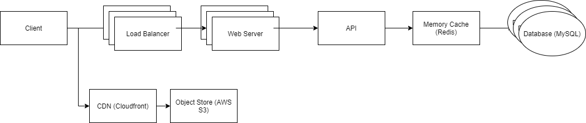

# System Design

System design section outlines use cases and constraints and design.

## Use Cases and Constraints

### Use Cases

Use cases:

- Customer can be authorized to save data that will be later reused without having to fill it up again.
- Customer can look through all the available resume templates.
- Customer can search templates by tags.
- Customer can filter and sort templates.
- Customer enters the credentials which will be used to generate resume.
- Customer generates resume on client side with [jsPDF](https://github.com/parallax/jsPDF) or similar library. This will reduce server workload.
- Admin has special panel that can be used to upload new resume template.
- Admin can preview generated resume from the given template before saving it.

Out of scope:

- Customer can create custom template.
- Subscriptions.
- Premium templates.
- Customer can add templates to favorite.

### Constraints and assumptions

State assumptions:

- Traffic is not evenly distributed.
- Generating resumes should be fast.
- Resumes consists only of one page.
- Resumes have only few available field. No way to extend them.
- 10K users per month.
- 2K new registered users per month.
- 10K resume generations per month.
- 50 new resume templates per month.
- 200:1 resume generation to resume creation ratio.

### Calculate usage

- Size per resume
  - `Id` - 4 bytes
  - `Resume template` - 16KB
  - `Title` - 64 bytes
  - `Description` - 256 bytes
  - `Views` - 4 bytes
  - `Created at` - 4 bytes
  - `Author id` - 4 bytes
  - `Image filename` - 16 bytes + 1 byte (period) + 3 bytes (extension) = 20 bytes
  - Total = ~16.35KB
- Size per user
  - `Id` - 4 bytes
  - `First name` - 32 bytes
  - `Second name` - 32 bytes
  - `Password` - 72 bytes
  - `Email` - 256 bytes
  - `Phone` - 16 bytes
  - Total = 412 bytes
- Total occupied size = ~817.38KB + ~804.69KB = ~1622.068KB per month
- ~2 new resume templates per day
- ~333 resume generation per day = ~13.89 resume generation per hour

## High level design


## Core components

### Tables

`resume_templates` table has the following structure:

```sql
id int not null
title varchar(64) NOT NULL
description varchar(256) NOT NULL
views INT UNSIGNED NOT NULL
created_at datetime NOT NULL
PRIMARY KEY(id)
```

`users` table has the following structure:

```sql
id int not null
first_name varchar(32) NOT NULL
second_name varchar(32) NOT NULL
password varchar(72) NOT NULL
email varchar(256) NOT NULL
phone varchar(16) NOT NULL
PRIMARY KEY(id)
```

### API

Resume builder uses REST API written in Laravel. The core endpoint is create resumes.

Create resume request:

```bash
curl -X POST --data \
    '{ "title": "Resume title", \
       "description": "Resume description", \
       "template": "<YOUR_TEMPLATE>", \
    }' \
    https://<WEBSITE>/api/resumes
```

Create resume response body:

```json
{
  "message": "Successfully created resume template"
}
```

## Scale the design



Object Store such as Amazon S3 can easily handle the constraint of 1622.068KB of new content per month.

With increasing user activity, **Memory Cache** can be used instead of the database to handle resume template reads.

## Outline

Previous design was lacking security considerations due to server side resume generation. Because of this, all resume generation will be done on the client side.
